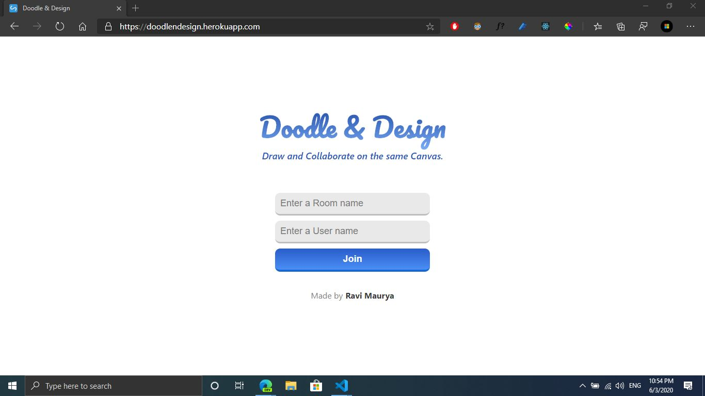
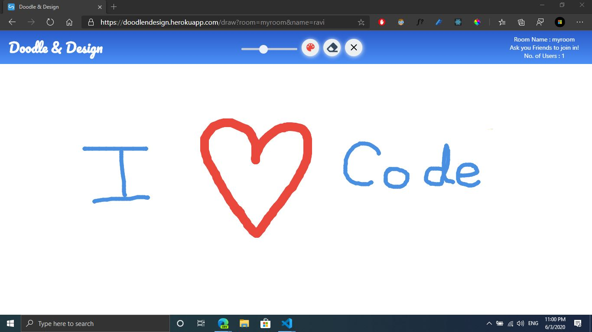

# Doodle & Design
A Web app to Draw and Collaborate on the Same Canvas. 
Check out : <a href="https://doodlendesign.herokuapp.com/" target="_blank">https://doodlendesign.herokuapp.com/</a>

## Install

    $ git clone https://github.com/RaviMauryaHootowl/Doodle-Design.git
    $ cd PROJECT
    $ npm install
    $ cd client
    $ npm install

## Run in Dev Mode

    $ npm run dev

## Run only Client

    $ npm run client
  
## Run only Server

    $ npm run server

## Authors

- **Ravi Maurya**